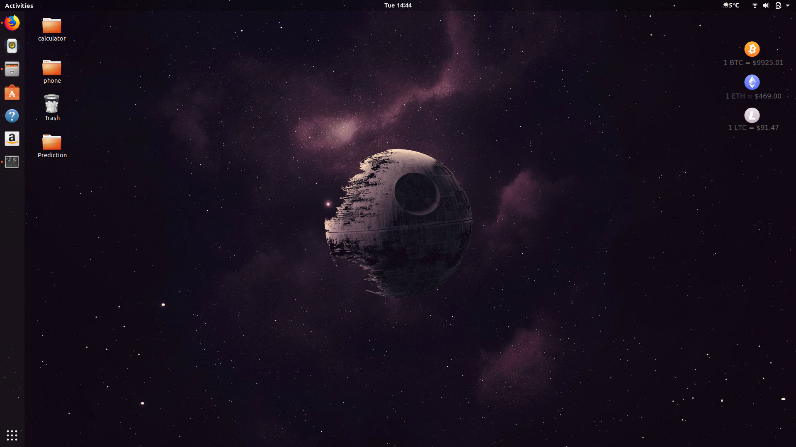

# conky-cryptoTrio
This conky theme displays real-time prices of Bitcoin (BTc), Ethereum (ETH), Litecoin (LTC) using the [Coinbase-api](https://developers.coinbase.com/).


## Dependencies
This script require the follwing modules/libraries: 
* Conky module; which can be installed using:
```
sudo apt install conky-all
```

## Installation
1. Dowload the project and extract it to your home folder.
2. Navigate to the folder and run the install script in the terminal using 
```
./install
```

## Tests
This code/script has been tested on ubuntu 17.10

## Screenshots


## Contributing
If you have any improvement's suggestions, please contact me.

## License
This project is licensed under the MIT License - see the [LICENSE.md](LICENSE.md) file for details

## Acknowledgments
This project was inspired by the following:
* [google-now-themed-conky-for-ubuntu-desktop](http://www.omgubuntu.co.uk/2013/05/google-now-themed-conky-for-ubuntu-desktop)
* [conky-finance](https://github.com/alseambusher/conky-finance)
* [Coinbase](https://developers.coinbase.com/)

The icons used are from [Cryptocurrency Icons](https://dribbble.com/shots/3513187-Cryptocurrency-Icons), by [Christopher Downer](https://dribbble.com/cjdowner)

